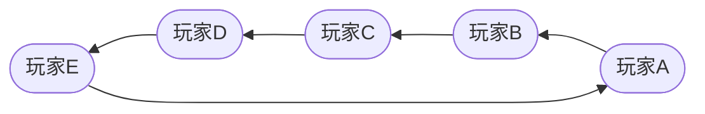
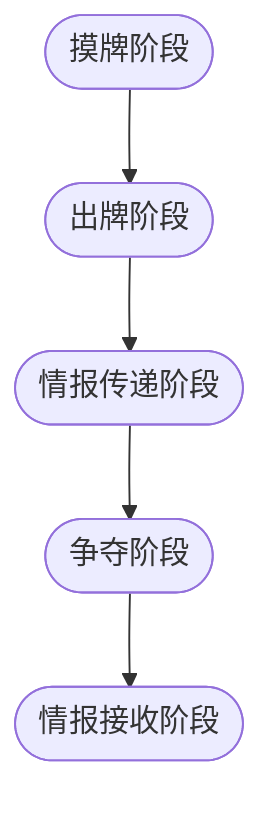

# FengSheng

## 声明

- **本项目采用`AGPLv3`协议开源，任何直接、间接接触本项目的软件也要求使用`AGPLv3`协议开源**
- **不鼓励，不支持一切商业用途**
- **本项目的作者由所有参与的开发者共同所有。请尊重各位开发者的劳动成果**
- **在使用前，使用者应该对本项目有充分的了解。任何由于使用本项目提供的接口、文档等造成的不良影响和后果与任何开发者无关**
- 由于本项目的特殊性，可能随时停止开发或删档
- 本项目为开源项目，不接受任何的催单和索取行为

## 配置

```yaml
listen_address: 127.0.0.1:9091  # 服务端监听端口
log:
    tcp_debug_log: true # 是否开启tcp调试日志
player:
    robot_count: 4  # 机器人人数
    total_count: 5  # 玩家总人数
rule:
  hand_card_count_begin: 3      # 游戏开始时摸牌数
  hand_card_count_each_turn: 3  # 每回合摸牌数
```

## 游戏步骤

玩家按照逆时针的顺序依次进行回合



每个回合只有五个阶段，且按照顺序进行


